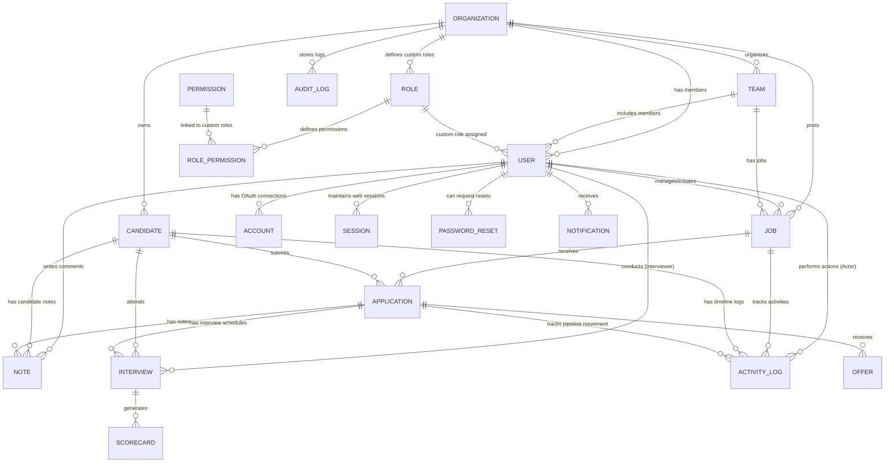

# Database Architecture Guide — HireTrack AI

HireTrack AI is built on a relational database design scoped for security, performance, and clear tenant boundary isolation.

## Entity Relationship (ER) Diagram (Textual Representation)

The core entities form the applicant tracking flow around the `Organization` entity, which serves as the primary tenant boundary.



---

## Multi-Tenant Strategy

HireTrack AI uses a **shared database, shared schema, row-level tenant boundary isolation** approach:
1. **Tenant Anchor**: Every major business object (`User`, `Job`, `Candidate`, `Team`, `Role`, `Invitation`, `Subscription`) belongs directly to an `Organization` via `organizationId`.
2. **Strict Scoping**: Every Database query inside Server Actions or API routes enforces scoping:
   ```typescript
   const user = await requirePermission('jobs:read')
   const jobs = await db.job.findMany({
     where: {
       organizationId: user.organizationId,
       deletedAt: null
     }
   })
   ```
3. **Cross-Tenant Prevention**:
   - The helper `requireOrganization(id)` verifies that the logged-in user belongs to the requested organization before allowing detail view reads or edits.
   - Unique constraints prevent cross-tenant duplication, e.g., candidate emails are constrained to be unique within a single organization: `@@unique([email, organizationId])`.

---

## Referential Integrity & Cascading Rules

We enforce relational consistency using database foreign keys with explicit cascade behaviors:
- `onDelete: Cascade` is applied to helper models whose lifecycle is tied directly to the parent model. If the parent is deleted, these helper records are automatically cleaned up to prevent database bloat. Examples:
  - `Account` and `Session` cascade delete when `User` is deleted.
  - `Application`, `Interview`, `Invitation`, `Team`, `Role`, and `Subscription` cascade delete when `Organization` is deleted.
  - `RolePermission` records cascade delete when `Role` or `Permission` is deleted.
  - `Scorecard` cascades on `Interview` deletion.
- `onDelete: SetNull` is used for relations where the data should persist even if the related actor is deleted. For example, audit logs or jobs created by a user should remain even if that user profile is removed:
  - `User.organizationId` set to `SetNull` (so we don't accidentally delete users if an org structure changes).
  - `Job.hiringManagerId` and `Job.createdById` set to `SetNull`.
  - `ActivityLog.actorId` set to `SetNull` to preserve timeline history.
  - `AuditLog.actorId` set to `SetNull` to maintain compliance logs.

---

## Query Optimization & Indexing

To handle fast search and low-latency pipeline renders, database indices have been added to columns queried during sorting, filtering, or join operations.

| Model | Index Target | Purpose |
| :--- | :--- | :--- |
| **Organization** | `[slug]` | Fast route resolution for organization subdomains or path routing. |
| **User** | `[email]`, `[organizationId]`, `[role]` | High-frequency login lookup, tenant validation, and authorization check. |
| **Job** | `[organizationId]`, `[status]`, `[createdAt]`, `[department]` | Pipeline sorting, active jobs listing, and search dashboard filtering. |
| **Candidate** | `[organizationId]`, `[status]`, `[email]` | Fast lookup by email/status, tenant boundaries. |
| **Application** | `[candidateId]`, `[jobId]`, `[stage]` | Kanban pipeline loading and candidate history views. |
| **Interview** | `[candidateId]`, `[applicationId]`, `[interviewerId]`, `[scheduledAt]` | Daily calendar loads, overdue alerts, and interviewer schedule maps. |
| **ActivityLog** | `[organizationId]`, `[candidateId]`, `[createdAt]` | Fast candidate activity timeline and audit tracing. |
| **AuditLog** | `[organizationId]`, `[createdAt]` | Security logging search operations. |

## Soft Delete Handling

Critical business records (`Job`, `Candidate`, `Application`) implement **soft deletion** using a nullable `deletedAt` DateTime field.
- In-place queries exclude deleted records: `where: { deletedAt: null }`.
- Restoring a soft-deleted record is simple as setting `deletedAt: null`.
- Keeps audit trails intact for compliance (e.g. tracking applications that were rejected or deleted).
