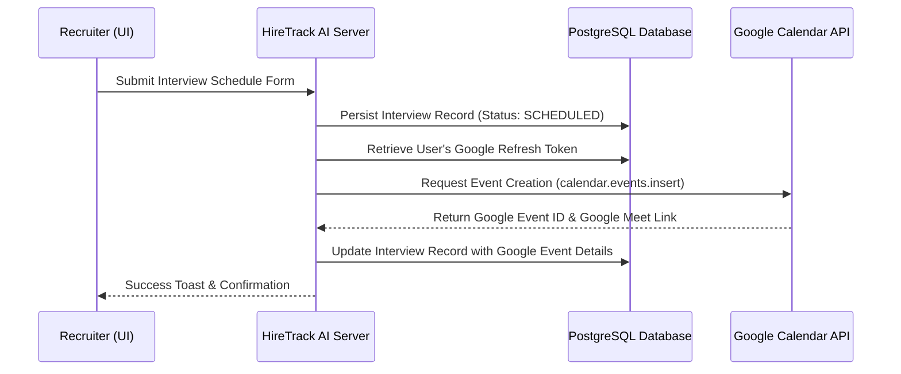
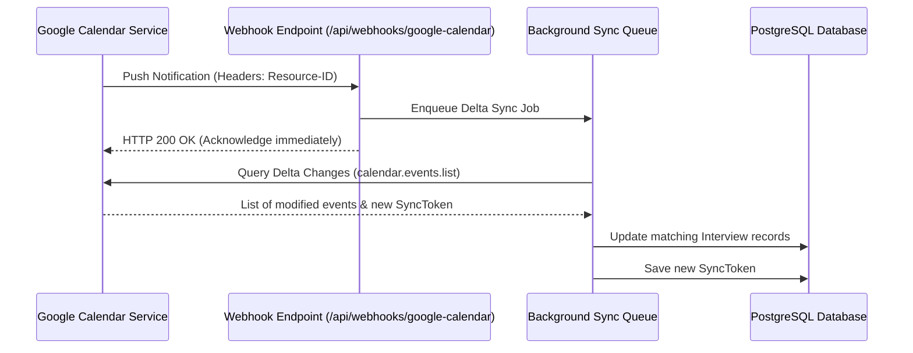

# Google Calendar Integration Architecture

This document describes the production-ready system architecture for integrating HireTrack AI with Google Calendar. The integration supports two-way calendar synchronization, allowing recruiters to schedule interviews directly from the ATS while ensuring updates made directly in Google Calendar (rescheduling, cancellations) sync back to HireTrack AI.

---

## 1. Authentication & Authorization Flow

### OAuth 2.0 Integration
We utilize Google APIs OAuth 2.0 flow to request permission to manage the user's or organization's calendar events.

1. **Scope Requirement:** `https://www.googleapis.com/auth/calendar.events` (Allows managing calendar events).
2. **Access Token & Refresh Token:** 
   - When a recruiter connects their Google Account, they complete the OAuth consent screen.
   - Google returns an `access_token` (expires in 1 hour) and a `refresh_token` (long-lived).
   - The `refresh_token` is securely encrypted (e.g. using AES-256-GCM) and saved in the database associated with the recruiter's `User` or `Account` record.

### Key Database Additions (Schema Model)
```prisma
model GoogleCalendarSync {
  id               String   @id @default(cuid())
  userId           String   @unique
  encryptedRefresh String   @db.Text
  resourceId       String?  // Used for webhook push channel
  channelId        String?  // Used for webhook push channel
  channelExpiration DateTime?
  syncToken        String?  // For delta-syncs
  createdAt        DateTime @default(now())
  updatedAt        DateTime @updatedAt

  user             User     @relation(fields: [userId], references: [id], onDelete: Cascade)
}
```

---

## 2. Real-Time Synchronization Workflows

### Scenario A: Scheduling/Updating an Interview from the ATS
When a recruiter schedules or reschedules an interview inside HireTrack AI:



- **Google Meet Auto-Generation:** The API request specifies `conferenceDataVersion: 1` with a request to generate a `hangoutsMeet` conference. The returned Google Meet link is stored in the `location` field of the `Interview` model.

---

### Scenario B: Synchronizing Changes from Google Calendar (Webhooks)
To catch events rescheduled or deleted inside Google Calendar, we register a webhook channel using Google Calendar's **Push Notifications API** (`calendar.events.watch`).

1. **Watch Request:** The ATS registers a watch channel pointing to a secure endpoint: `https://hiretrack-ai.com/api/webhooks/google-calendar`.
2. **Push Notifications:** When an event is updated or deleted in Google Calendar, Google sends a POST request to our webhook endpoint with the headers `X-Goog-Resource-ID` and `X-Goog-Channel-ID`.
3. **Delta Syncing:**
   - The webhook handler queries the updated events using `calendar.events.list` with the stored `syncToken` to fetch only changes.
   - The server matches the updated Google Event ID with our `Interview` database records and updates the `scheduledAt`, `duration`, `location`, or `status` (e.g., marks `CANCELLED` if the event was deleted).



---

## 3. Resilience, Queuing & Conflict Resolution

### Background Job Queue (BullMQ / Redis)
Network requests to external APIs are prone to temporary latency or failures. All calendar syncing operations are delegated to a background task runner rather than blocking HTTP responses in the Next.js API.
- **Failures:** If Google Calendar API is rate-limited or offline, the job is retried using exponential backoff.
- **Circuit Breaker:** If a user's tokens become invalid (e.g. they revoked permissions), the sync channel is automatically paused, and a database notification is triggered advising the user to reconnect their account.

### Conflict Resolution
When modifications happen simultaneously on both sides:
- **Rule:** The **ATS remains the source of truth** for stage transitions and scorecard evaluation.
- **Time/Schedule Sync:** If the event's time changes on Google Calendar, it updates the scheduled time in the ATS. If the event is deleted from Google Calendar, we update the status in the ATS to `CANCELLED` but do not delete the candidate/application record.
- **Locking:** We implement row-level optimistic locking or queue serialized jobs per-interview to prevent race conditions during updates.
